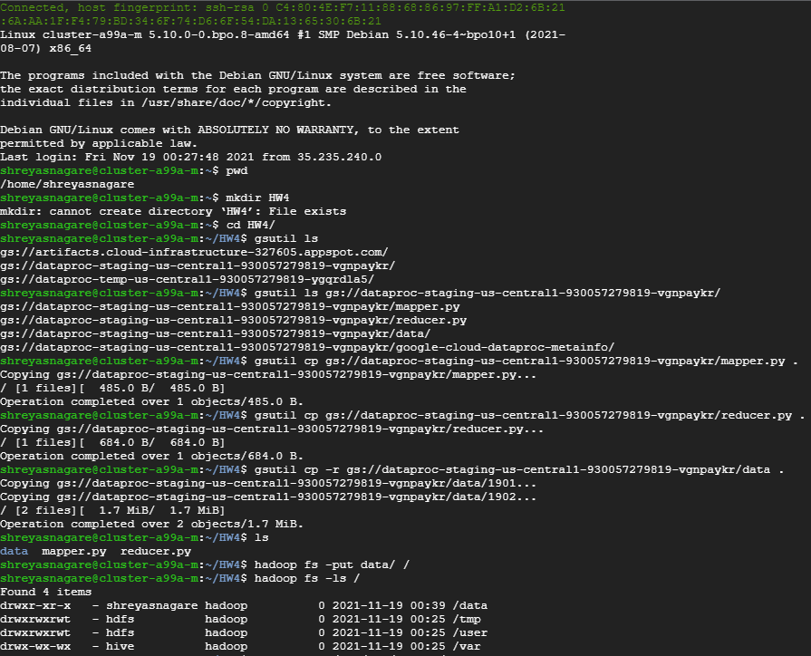
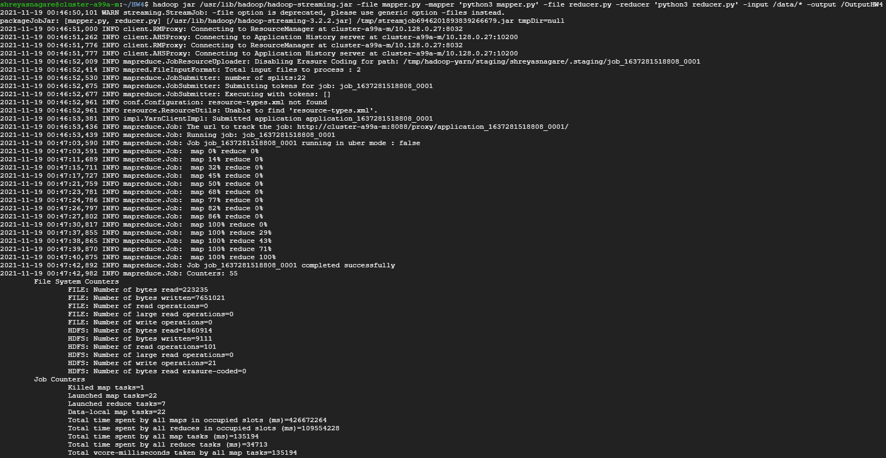
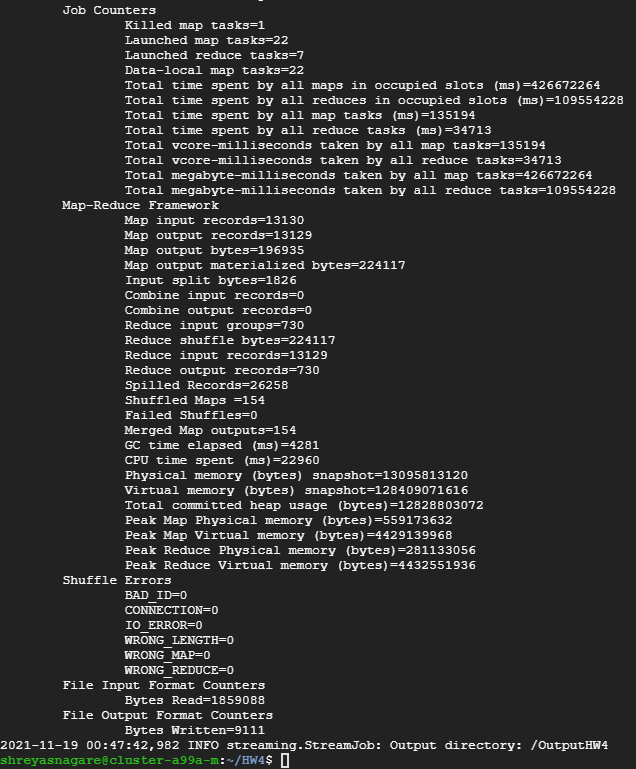
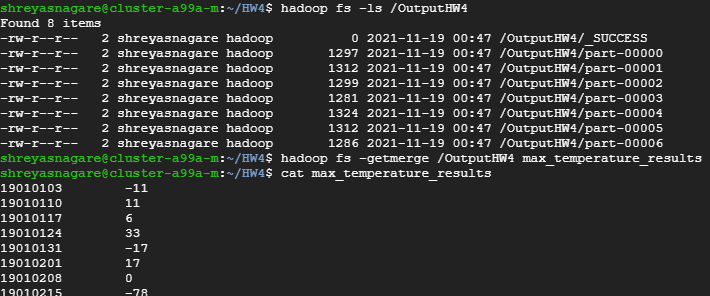

# Hadoop MapReduce Application on GCP Dataproc (with Data Uploader GUI)

This is a MapReduce application to find maximum temperature in every day of years 1901 and 1902 from the NCDC weather records.

## Copying Data

## Execution

## Merging Results

## GUI Demo
